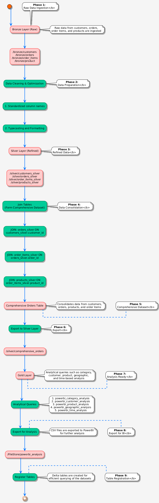

# ETL PIPELINE WITH DELTA LAKE IN DATABRICKS

Modern ETL pipeline with Databricks & Delta Lake implementing medallion architecture for retail analytics | Features: Delta Lake ACID transactions, data quality checks, PowerBI integration, multi-layer transformations | Built with PySpark

[](https://databricks.com)
[](https://spark.apache.org)
[](https://delta.io)
[](https://powerbi.microsoft.com)

> A robust ETL pipeline implementing the medallion architecture for retail analytics using Azure Databricks and Delta Lake.

## Table of Contents
- [Overview](#-overview)
- [Architecture](#-architecture)
- [Key Features](#-key-features)
- [Tech Stack](#-tech-stack)
- [Analytics Capabilities](#-analytics-capabilities)
- [Getting Started](#-getting-started)
- [Project Structure](#-project-structure)
- [Data Transformations](#-data-transformations)
- [Analytics Outputs](#-analytics-outputs)
- [Future Scope](#-future-scope)

## Overview

DeltaStore is an end-to-end data engineering solution that implements a modern data lakehouse architecture. The project showcases:

- Medallion architecture implementation
- Retail analytics processing
- Data quality validation
- Business intelligence integration

## Architecture



### Data Flow Stages:

#### 🥉 Bronze Layer (Raw)
```
Raw Data Ingestion
    │
    ├── Schema Enforcement
    │   └── Data Type Validation
    │
    └── Quality Checks
        ├── Null Checks
        ├── Duplicate Detection
        └── Format Validation
```

#### 🥈 Silver Layer (Refined)
```
Data Cleaning
    │
    ├── Schema Standardization
    │   └── Column Naming
    │
    └── Data Integration
        ├── Reference Data
        └── Lookups
```

#### 🥇 Gold Layer (Business)
```
Business Logic
    │
    ├── Aggregations
    │   └── Metrics Calculation
    │
    └── Optimization
        ├── Partitioning
        └── Indexing
```

## Key Features

| Feature | Description |
|---------|-------------|
| Delta Lake Integration | ACID transactions, versioning, time travel |
| Data Validation | Comprehensive quality checks at each layer |
| Advanced Analytics | Business-ready metrics and insights |
| Visualization | Direct Power BI integration |

## Tech Stack

<details>
<summary>Click to expand!</summary>

### Core Technologies
-  Azure Databricks
-  PySpark
-  Delta Lake
-  Power BI

### Languages & Frameworks
- Python 3.8+
- SQL
- Scala (Optional)

### Development Tools
- Git
- VS Code
- Databricks Notebooks
</details>

##  Analytics Capabilities

### Product Analytics
-  Category-wise profit analysis
-  Order frequency patterns
-  Revenue generation insights

### Customer Insights
-  Customer segmentation
-  Geographic distribution
-  Spending patterns

##  Getting Started

### Prerequisites
```plaintext
- Azure Databricks Account
- Power BI Desktop
- Python 3.8+
- Git
```

### Quick Start 🏃‍♂

1. Clone the repository
```bash
git clone https://github.com/yourusername/deltastore.git
```

2. Configure Databricks connection
```python
spark.conf.set("spark.databricks.deltaStore.path", "/your/path")
```

3. Run the pipeline
```bash
python run_pipeline.py
```

##  Project Structure

```plaintext
deltastore/
├── 📁 notebooks/
│   ├── 📔 1_bronze_layer.ipynb
│   ├── 📔 2_silver_layer.ipynb
│   └── 📔 3_gold_layer.ipynb
├── 📁 src/
│   ├── 📜 data_quality.py
│   ├── 📜 transformations.py
│   └── 📜 utils.py
├── 📁 config/
│   └── 📜 config.yaml
└── 📊 dashboards/
    └── 📊 retail_analytics.pbix
```

##  Data Transformations

<details>
<summary>Bronze → Silver Transformations</summary>

```python
# Sample transformation code
def clean_customer_data(df):
    return df.withColumn(
        "clean_email",
        lower(col("email"))
    ).dropDuplicates()
```
</details>

<details>
<summary>Silver → Gold Transformations</summary>

```python
# Sample aggregation code
def calculate_customer_metrics(df):
    return df.groupBy("customer_id").agg(
        sum("amount").alias("total_spent"),
        count("order_id").alias("order_count")
    )
```
</details>

## 📈 Analytics Outputs

### Key Metrics Generated
- Total Revenue by Category
- Customer Lifetime Value
- Product Performance Scores
- Geographic Sales Distribution
- Customer Segmentation Analysis
- Order Frequency Patterns
- Seasonal Trends Analysis
- Inventory Turnover Rates

## Future Scope

-  ML Model Integration
-  Real-time Processing
-  Automated Pipelines
-  Mobile Analytics

##  Contributing

Contributions welcome! Please check out our [contribution guidelines](CONTRIBUTING.md).

##  License

This project is licensed under the MIT License - see the [LICENSE](LICENSE) file for details.

##  Acknowledgments

- Special thanks to Mr. Manoj Pal for mentorship
-  Veersa Technologies for project support
-  All contributors and team members


